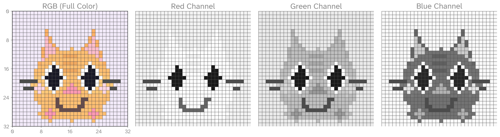

---
execute:
  echo: false
jupyter: mas2901
tbl-cap-location: bottom

---


# What is Statistical Inference?

::: {.callout-note collapse="true" title="Learning objectives"}
- Define *population* and *sample*, and identify each in simple scenarios.
- State the *goal* of statistical inference: using a sample to learn about a population distribution.
- Recognise the idea of a *random sample* $X_1,\dots,X_n$ and the iid assumption.
- Define a *statistical model* as a set of distributions $\{P_\theta:\theta\in\Theta\}$.
- Identify the *parameter(s)* $\theta$ and the *parameter space* $\Theta$ for a given model.
- Write down a suitable statistical model for a short verbal problem.
:::


```{ojs}
bodyFont = getComputedStyle(document.body).fontFamily
```

Statistical inference underpins experimental science, machine learning, clinical trials, and more. The overall aim is:

* Given a **sample** (the data you have) from a **population** (the broader group you care about),
* Draw a justified **conclusion about the population’s distribution**.

Typical conclusions include estimating a proportion or mean, quantifying uncertainty, comparing groups, or predicting future outcomes.

::: {#imp-notation-dist .callout-important collapse="true" appearance="simple"}
### Notation: $\mathrm{Distribution}(\theta)$

In the following, we use $\mathrm{Distribution}(\theta)$ as a **placeholder** to mean:

> “a distribution depending on parameter $\theta$.”

For example:

* $\mathrm{Distribution}(\mu,\sigma^2) = \mathcal{N}(\mu,\sigma^2)$
* $\mathrm{Distribution}(p) = \mathrm{Bernoulli}(p)$

This allows us to keep the definitions *general*! 
:::

::: {#imp-terminology-sample .callout-important collapse="true" appearance="simple"}
### Terminology: Population, Sample, Data

- **Population:** the entire group we want to study (conceptual, often infinite).  
- **Sample:** the $n$ random variables we actually collect from the population $X_1,X_2,\ldots, X_n$.  
- **Data:** the realised values of the sample once observed $x_1,x_2,\ldots, x_n$.  
- **Observation / data point:** a single element of the sample, e.g. $X_i$ (random) or $x_i$ (observed).  

**Note:** In practice, the terms *data*, *observations*, and *data points* are often used interchangeably. In these notes, we’ll do the same unless we need to be precise about whether something is random (sample) or fixed (data).
:::


## Statistical Inference as "Inverse Probability" {#sec-stat-inf-as-inv-prob}

In **probability theory**, the usual direction is:

* Start with a distribution $f(x \mid \theta)$ (the model, with known parameter $\theta$).
* Use it to generate random samples, or calculate probabilities of events involving the data.

In **statistical inference**, we reverse the problem:

* We observe data $\underline{x} = (x_1,\ldots,x_n)$.
* The distribution $f(x \mid \theta)$ is only partially known, through the unknown parameter $\theta$.
* Our task is to use the sample to learn about $\theta$, and hence about the population distribution.

Formally, we (*usually*) assume our data are an **i.i.d. sample**:

$$
X_1,\ldots,X_n \stackrel{\text{iid}}{\sim} \mathrm{Distribution}(\theta).
$$

- *Independent*: knowing the value of one $X_i$ gives no information about any other.  
- *Identically distributed*: each $X_i$ comes from the same population distribution $f(x \mid \theta)$.  

The goal of *statistical inference* is to use the observed sample to learn about $\theta$, and hence about the underlying population. 

::: {#imp-term-random-sample .callout-important collapse="true" appearance="simple"}
### Terminology: Random Sample

- A <span class="xref-no-num">[sample @imp-terminology-sample]</span> means the $n$ random variables we collect from the population, $X_1,\dots,X_n$. These need not be independent or identically distributed.  

- A **random sample** is the special case where the $X_i$ are assumed *independent and identically distributed (i.i.d.)* from the same distribution:
  $$
  X_1, \dots, X_n \stackrel{\text{iid}}{\sim} \mathrm{Distribution}(\theta).
  $$

Most of the inference procedures in this course are developed under the random-sample (iid) assumption.
:::

### Statistical Inference by Eye {#sec-inference-eye}

As an informal starting point, suppose $X_1,\ldots,X_n$ are sampled from a $\mathcal{N}(\mu,\sigma^2)$ distribution, with $\mu$ and $\sigma^2$ unknown. 

Try to “guess” $\mu$ and $\sigma^2$ by eye from the data:

::: {.content-visible unless-format="pdf"}

---

```{=html}
<details>
  <summary> Show Visualisation </summary>
```

```{ojs}
// helper for curve scale
approxSigma = Math.sqrt(approxVar)

// density histogram + normal pdf (returns an SVG node)
histVis = {
  const colHist  = "var(--brand-teal, #55C3CB)";
  const colCurve = "var(--brand-red, #e65660)";
  const gridCol  = "var(--plot-grid, #94a3b8)";

  // --- x-domain based on data (with padding) ---
  const xMin = d3.min(data), xMax = d3.max(data);
  const pad = 0.4 * (xMax - xMin || 1);
  const domain = [xMin - pad, xMax + pad];

  const binCount = bins ?? 30;

  // --- compute density bins manually: density = count / (n * binWidth) ---
  const bin = d3.bin().domain(domain).thresholds(binCount);
  const B = bin(data);
  const n = data.length;
  for (const b of B) b.density = b.length / (n * (b.x1 - b.x0));

  // --- normal pdf on same domain ---
  const xs = d3.range(domain[0], domain[1], (domain[1] - domain[0]) / 400);
  const normalPdf = (x, mu, sigma) => (1/(sigma*Math.sqrt(2*Math.PI))) * Math.exp(-0.5*((x-mu)/sigma)**2);
  const curve = xs.map(x => ({ x, y: normalPdf(x, approxMu, approxSigma) }));

  // --- shared y-domain (max of both) ---
  const ymax = 1.1 * Math.max(
    d3.max(B, d => d.density) ?? 0,
    d3.max(curve, d => d.y) ?? 0
  );

  return Plot.plot({
    height: 360,
    marginLeft: 50,
    marginBottom: 50,
    x: { label: "x", domain },
    y: { label: "Density", grid: true, domain: [0, ymax], tickSize: 6 },
    style: {
      background: "var(--brand-bg)",
      fontSize: 14,
      fontFamily: bodyFont,
      width: "100%",
      display: "block",
      margin: "0 auto",
      maxWidth: "1200px",
      color: "var(--fg-strong, currentColor)"
    },
    marks: [
      // density histogram (teal)
      Plot.rectY(
        B,
        { x1: d => d.x0, x2: d => d.x1, y: d => d.density,
          fill: colHist, fillOpacity: 0.35, stroke: colHist, strokeOpacity: 0.7 }
      ),
      // normal pdf (orange)
      Plot.line(curve, { x: "x", y: "y", stroke: colCurve, strokeWidth: 2.5 }),
      // baseline
      Plot.ruleY([0], { stroke: gridCol, strokeOpacity: 0.4 })
    ]
  });
}
```

```{ojs}
// Ranges sourced from your controls
mu_min = mu_true - muHalfWidth
mu_max = mu_true + muHalfWidth
var_min = 0
var_max = sig2Max

// Responsive 2D slider (scales with its container)
viewof muVar2D = {
  // Logical drawing size (not CSS pixels)
  const width = 220, height = 220;
  const margin = {top: 20, right: 5, bottom: 5, left: 5};
  const W = width - margin.left - margin.right;
  const H = height - margin.top - margin.bottom;

  // --- helper: clamp number to [lo, hi] ---
  const clamp = (v, lo, hi) => Math.min(hi, Math.max(lo, v));

  // Scales (y increases upward in data space)
  const x = d3.scaleLinear().domain([mu_min, mu_max]).range([0, W]).clamp(true);
  const y = d3.scaleLinear().domain([var_min, var_max]).range([H, 0]).nice().clamp(true);

  // Initial value
  let state = {
    approxMu: clamp(mu_true, mu_min, mu_max),
    approxVar: clamp((var_max - var_min) * 0.4, var_min, var_max)
  };

  const bg = "var(--plot-panel-bg)";
  const grid = "var(--plot-grid, #94a3b8)";
  const colHandle = "var(--brand-red, #e65660)";
  const colAccent = "var(--brand-teal, #55C3CB)";

  // Wrapper that controls responsive size
  const wrap = html`<div style="
    width: 100%;
    max-width: 320px;      /* cap size; tweak as you like */
    aspect-ratio: 1 / 1;   /* keep it square */
    display: block;
  "></div>`;

  // SVG uses logical coords; CSS scales it
  const svg = d3.create("svg")
    .attr("viewBox", `0 0 ${width} ${height}`)
    .attr("preserveAspectRatio", "xMidYMid meet")
    .style("width", "100%")
    .style("height", "100%")
    .style("background", "transparent")
    .attr("stroke-opacity", 0.)
    .style("font-family", bodyFont)
    .style("font-size", "14px");

  const g = svg.append("g").attr("transform", `translate(${margin.left},${margin.top})`);

  // Background panel
  g.append("rect")
    .attr("x", 0).attr("y", 0).attr("width", W).attr("height", H)
    .attr("rx", 10)
    .attr("fill", bg)
    .attr("stroke", grid).attr("stroke-opacity", 0.5);

  // Crosshairs
  const crossX = g.append("line")
    .attr("stroke", colAccent)
    .attr("stroke-opacity", 0.7)
    .attr("stroke-width", 1.5);

  const crossY = g.append("line")
    .attr("stroke", colAccent)
    .attr("stroke-opacity", 0.7)
    .attr("stroke-width", 1.5);

  // Handle
  const handle = g.append("circle")
    .attr("r", 5)
    .attr("fill", colHandle)
    .attr("stroke", "white")
    .attr("stroke-width", 1.5)
    .style("cursor", "grab");

  // Readout
  const readout = svg.append("text")
    .attr("x", width / 2)        // center horizontally
    .attr("y", margin.top / 1.5) // just above the chart area
    .attr("text-anchor", "middle")
    .attr("fill", "var(--fg-strong, currentColor)")
    .style("font-weight", 400);

  function updateVisual() {
    const cx = x(state.approxMu), cy = y(state.approxVar);
    crossX.attr("x1", 0).attr("x2", W).attr("y1", cy).attr("y2", cy);
    crossY.attr("x1", cx).attr("x2", cx).attr("y1", 0).attr("y2", H);
    handle.attr("cx", cx).attr("cy", cy);
    readout.text(`μ≈ ${state.approxMu.toFixed(2)},        σ²≈ ${state.approxVar.toFixed(2)}`);
  }

  function setFromPointer(evt) {
    const [px, py] = d3.pointer(evt, g.node()); // in SVG user units (matches viewBox)
    const mu = clamp(x.invert(px), mu_min, mu_max);
    const vv = clamp(y.invert(py), var_min, var_max);
    state = { approxMu: mu, approxVar: vv };
    root.value = { approxMu: state.approxMu, approxVar: state.approxVar };
    root.dispatchEvent(new CustomEvent("input", {bubbles: true}));
    updateVisual();
  }

  // Interaction overlay
  g.append("rect")
    .attr("x", 0).attr("y", 0).attr("width", W).attr("height", H)
    .attr("fill", "transparent")
    .style("cursor", "crosshair")
    .on("pointerdown", function(evt) {
      this.setPointerCapture?.(evt.pointerId);
      handle.style("cursor", "grabbing");
      setFromPointer(evt);
    })
    .on("pointermove", function(evt) {
      if (evt.pressure > 0 || evt.buttons) setFromPointer(evt);
    })
    .on("pointerup", function(evt) {
      this.releasePointerCapture?.(evt.pointerId);
      handle.style("cursor", "grab");
    });

  // Root element with .value is the wrapper (so CSS controls size)
  const root = wrap;
  root.append(svg.node());
  root.value = { approxMu: state.approxMu, approxVar: state.approxVar };

  updateVisual();
  return root;
}

// Reactive outputs
approxMu = muVar2D.approxMu
approxVar = muVar2D.approxVar
```

```{ojs}
// Layout container placing the histogram (left, 2fr) and slider (right, 1fr)
{
  const wrap = html`<div style="
    display: grid;
    grid-template-columns: 3fr 1fr;  /* change to 3fr 1fr for ~3:1 */
    gap: 0.5rem;
    align-items: start; /* left plot stays top-aligned */
  "></div>`;

  // Histogram (left)
  wrap.append(histVis);

  // Slider (right, vertically centered)
  const sliderBox = html`<div style="display:flex; align-items:center; height:100%"></div>`;
  sliderBox.append(viewof muVar2D);
  wrap.append(sliderBox);

  return wrap;
}
```

```{ojs}
// data
data = {
  resample; // reacts to the "Resimulate data" button
  const rnd = d3.randomNormal(mu_true, sigma_true);
  return Array.from({ length: n }, () => rnd());
}
```

```{ojs}
// --- Build one merged, collapsible control "input" ---
viewof controls = {
  const resimBtn = Inputs.button("Resimulate data");
  resimBtn.classList.add("btn-resim");

  const leftForm = Inputs.form({
    n: Inputs.range([1, 400], { value: 50, step: 1, label: md`${tex`n`}` }),
    mu_true: Inputs.range([-5, 5], { value: 0.5, step: 0.05, label: md`${tex`\mu_{\text{true}}`}` }),
    sigma_true: Inputs.range([0.3, 4], { value: 1.2, step: 0.05, label: md`${tex`\sigma_{\text{true}}`}` })
  }, { submit: false });

  const rightForm = Inputs.form({
    muHalfWidth: Inputs.range([1, 10], { value: 5, step: 0.05, label: md`${tex`\mu\text{-range}`}` }),
    sig2Max: Inputs.range([0.2, 10], { value: 5, step: 0.05, label: md`${tex`\sigma^2\text{ max}`}` }),
    bins: Inputs.range([10, 60], { value: 12, step: 1, label: "Histogram bins" })
  }, { submit: false });

  const root = html`<details class="controls-root" open>
    <summary>Simulation controls</summary>
    <div class="controls-grid">
      <div class="controls-col"><h4>Data & truth</h4></div>
      <div class="controls-col"><h4>Grid & display</h4></div>
    </div>
  </details>`;

  const grid = root.querySelector(".controls-grid");
  grid.children[0].append(leftForm);
  grid.children[1].append(rightForm);

  const btnWrap = html`<div style="display:flex; justify-content:flex-start; margin-top:6px;"></div>`;
  btnWrap.append(resimBtn);
  grid.children[1].append(btnWrap);

  const getValue = () => ({ ...leftForm.value, ...rightForm.value, resim: resimBtn.value });
  const update = () => { root.value = getValue(); root.dispatchEvent(new CustomEvent("input", { bubbles: true })); };

  grid.addEventListener("input", update);
  queueMicrotask(update);
  return root;
}

// --- Expose reactive vars
n = controls.n
mu_true = controls.mu_true
sigma_true = controls.sigma_true
muHalfWidth = controls.muHalfWidth
sig2Max = controls.sig2Max
bins = controls.bins
resample = controls.resim

```


```{=html}
</details>
```

---

:::

## Types of Data {#sec-types-of-data}

Before we build **statistical models**, it helps to think about the kinds of data we might collect.
Different data types naturally lead to different models.

### Univariate vs. Multivariate data

::: {#imp-term-unit .callout-important collapse="true" appearance="simple"}

#### Terminology: Unit

An **observational unit** (or simply *unit*) is a single element of the population on which we make a measurement.  

- In a survey of students: each *student* is a unit.  
- In a clinical trial: each *patient* is a unit.  
- In a manufacturing study: each *product* is a unit.  
- In an image analysis study: each *image* is a unit.

:::

* **Univariate** data: a single measurement per observational unit.
  
  > *Example:* the height of each student in a class.

* **Multivariate** data: two or more measurements on each unit.
  
  > *Example:* the height and weight of each student (bivariate); or height, weight, and age (multivariate).


Data are often represented in **tables**.  

::: {.panel-tabset}

### Univariate data

Each unit has **one measurement**. 

| Year        | 2011 | 2012 | 2013 | 2014 | 2015 | 2016 | 2017 | 2018 | 2019 | 2020 |
|:-----------:|:----:|:----:|:----:|:----:|:----:|:----:|:----:|:----:|:----:|:----:|
| Earthquakes |    4 |    0 |    2 |    6 |    4 |    0 |    2 |    8 |    5 |    7 |

: **Earthquake counts.** Table shows the number of UK earthquakes of magnitude $≥2$ on the Richter scale each year. {#tbl-earthquakes}

Here, the **units** are the years (2011–2020), and the (single) **variable** is the annual count of UK earthquakes.

### Multivariate data

Each unit has **two or more measurements**.  

| Station | Rainfall (mm) | Wind speed (km/h) | Pressure (hPa) |
|:-------:|:-------------:|:-----------------:|:--------------:|
| A       | 214.8 | 87 | 995 |
| B       | 196.3 | 91 | 992 |
| C       | 180.2 | 79 | 1001 |
| D       | 205.5 | 94 | 998 |
| E       | 209.0 | 89 | 997 |
| …       | …     | …  | …   |

: **Weather data.** Average rainfall, wind speed, and air pressure recorded at weather stations during a storm. {#tbl-weather}

Here, the **units** are the weather **stations** (during the same storm), and the **variables** are rainfall (mm), wind speed (km/h), and pressure (hPa).

:::

Some data is **extremely high-dimensional**:

::: {#exm-image-data}
#### Image Data

An image is made of a grid of **pixels**, where each pixel is a **colour**.  

A colour can be represented by three channels: red, green, and blue[^a-channel].

{#fig-pixel}

Each pixel has **multiple measurements** (one per channel), so images are an example of **high-dimensional multivariate data**. To see why, consider the size of real images:

- A tiny image of size $32\times 32$ pixels with 3 channels (RGB) already has $32\times 32 \times 3 = 3072$ measurements.
- A small image of size $128 \times 128$ pixels with 3 channels (RGB) has  
  $128 \times 128 \times 3 \approx 50{,}000$ measurements.  
- A “HD” photo of size $1920 \times 1080$ (1080p) contains over  
  $1920 \times 1080 \times 3 \approx 6.2$ million measurements.  

So even a single image can be thought of as a *very high-dimensional observation*. And **videos** are higher still: sequences of such images evolving over time[^compression].

:::


::: {.callout-warning}
### Non-Examinable Content: Multivariate Data
In this course we focus **only on univariate data** (one measurement per observational unit).  

Although many real-world problems involve **multivariate data** (two or more measurements on the same unit), this topic will be studied in later statistics courses.
:::


### Numerical data

* **Continuous**: can take any real value in an interval.
  
  > *Examples:* height, weight, reaction time.
  >
  > *Models:* Normal, Exponential, Uniform.

* **Discrete numeric**: counts, usually non-negative integers.
  
  > *Examples:* number of accidents in a week, number of goals in a football match.
  >
  > *Models:* Binomial, Poisson, Geometric.


::: {.panel-tabset}

### Continuous data

| Star   | Apparent magnitude |
|:------:|:------------------:|
| Sirius | –1.46 |
| Vega   |  0.03 |
| Altair |  0.77 |
| Deneb  |  1.25 |
| …      | … |

: **Astronomy data.** The brightness of a star (its *magnitude*) is measured on a continuous scale. . {#tbl-astronomy}

### Discrete data

| Match                                | Home goals | Away goals |
|:------------------------------------:|:----------:|:----------:|
| Newcastle United vs Arsenal          | 7 | 0 |
| Manchester United vs Liverpool F.C.  | 0 | 1 |
| Tottenham Hotspur vs Chelsea F.C.    | 1 | 3 |
| Aston Villa vs Leeds United          | 3 | 2 |
| West Ham United vs Manchester City   | 0 | 4 |
| Brighton & Hove Albion vs Everton    | 2 | 2 |
| Leicester City vs Southampton        | 1 | 0 |
| Wolverhampton Wanderers vs Brentford | 2 | 1 |
| Crystal Palace vs Fulham             | 0 | 1 |
| Nottingham Forest vs Bournemouth     | 1 | 1 |
| …                                    | … | … |


: **Sports analytics.** Goals scored in football matches are discrete counts. Each match provides *multivariate discrete data* (two counts per unit). {#tbl-goals}

### Mixed data

In practice, most datasets are **mixed**

| Patient | Age (years) | Reaction time (ms) | Smoker (yes/no) |
|:-------:|:-----------:|:------------------:|:---------------:|
| A       | 22 | 318 | Yes |
| B       | 35 | 241 | No  |
| C       | 41 | 267 | Yes |
| D       | 29 | 452 | No  |
| …       | …  | …   | …   |

: **Medical study.** Here each patient (unit) has both continuous and discrete measurements. {#tbl-mixed}

:::

### Categorical data

* **Nominal**: categories with no natural order.
  
  > *Examples:* hair colour, brand of cereal, country of birth.

* **Ordinal**: categories with a natural order, but not numerical spacing.
  
  > *Examples:* customer satisfaction ratings (“poor”, “fair”, “good”, “excellent”).

Categorical data are often summarised in **contingency tables** (tables of counts).

::: {.panel-tabset}

### One-way table

If we record the colours of sweets drawn from a bag:

| Colour    | Count |
|:----------|------:|
| Red       |   $R$ |
| Blue      |   $B$ |
| Green     |   $G$ |
| **Total** |   $n$ |

This simple *one-way* table leads naturally to the <span class="xref-no-num">[multinomial model @sec-multinomial]</span>.

### Two-way table

Suppose we also record the *shop* where each sweet was bought (Shop A or Shop B).  
Now we cross-classify by both colour and shop:

| Colour | Shop A | Shop B | **Total** |
|:-------|-------:|-------:|----------:|
| Red    | $R_A$  | $R_B$  | $R$       |
| Blue   | $B_A$  | $B_B$  | $B$       |
| Green  | $G_A$  | $G_B$  | $G$       |
| **Total** | $n_A$ | $n_B$ | $n$ |

This *two-way* contingency table allows us to ask questions like:  

> *“Are colours distributed differently across shops?”*

Later in the course we will see this leads to the **chi-squared test of independence**.

:::


## Statistical Models

Whenever we perform statistical inference, we must specify a **model**.

In @sec-stat-inf-as-inv-prob we wrote
$$
X_1,\ldots,X_n \stackrel{\text{iid}}{\sim} \mathrm{Distribution}(\theta)
$$
using $\mathrm{Distribution}(\theta)$ as a placeholder for “some distribution indexed by $\theta$”.

We now make this precise:

> A **statistical model** is a mathematical description of how we think the data are generated.  
> Concretely, it is a **family of possible distributions**, one for each parameter value in a parameter space $\Theta$.


::: {.example #exm-exponential-model}
### Exponential model
Suppose we are interested in modelling **waiting times** until some event occurs (e.g. the time between customer arrivals at a service desk).  

A natural assumption is that the data are i.i.d. <span class="xref-no-num">[exponential @sec-exp]</span>:
$$
X_1,\ldots, X_n \stackrel{\text{iid}}{\sim}\mathrm{Exponential}(\lambda).
$$

- **Model:** each $X_i$ is i.i.d. exponential with rate $\lambda$
- **Parameter:** $\theta = \lambda$
- **Parameter space**[^sets1] **:** $\Theta = \{ \lambda \mid \lambda > 0\} = (0,\infty)$

The exponential model often arises in *Poisson processes*, where events occur independently at a constant rate (e.g. radioactive decay, arrivals at a bus stop).
:::

::: {.example #exm-normal-model}
### Normal model
In @sec-inference-eye we assumed the data were i.i.d. Normal with unknown mean and variance:
$$
X_1,\ldots, X_n \stackrel{\text{iid}}{\sim} \mathcal{N}(\mu, \sigma^2).
$$

- **Model:** each $X_i$ is i.i.d. Normal with mean $\mu$ and variance $\sigma^2$
- **Parameters:** $\theta = (\mu,\sigma^2)$  
- **Parameter space**[^sets2] **:**  $\Theta = \{ (\mu, \sigma^2) \mid \mu \in \mathbb{R}, \sigma^2 > 0 \} = \mathbb{R} \times (0,\infty)$  

This model is widely used, e.g. for measurement error or traits like human height.
:::

::: {.callout-tip}
### Common Misconceptions

- **Parameter $\neq$ statistic.**  
  A *parameter* $\theta$ describes a feature of the population (e.g. $p, \mu, \sigma^2$).  
  A *statistic* (e.g. $\bar{X}$, a sample proportion) is calculated from the sample and used to learn about $\theta$.

- **“Random sample” is not just “whatever data we found”.**  
  A random sample means data collected in a way that makes the i.i.d. assumption reasonable (e.g. independent trials, simple random sampling).  
  
  > Example: If your population is *all humans on the planet*, then sampling only your family would not be random and could bias inference.

- **Models are approximations.**  
  In practice you should treat models as *useful simplifications*, not as exact descriptions of reality. It’s important to choose them sensibly, and be prepared to adjust if they don’t fit the data well.
:::

::: {.example #exm-identify-model}
### From words to a model
A questionnaire records whether each respondent would recommend a service (“yes” or “no”). Write down a simple model and identify the parameter.

```{=html}
<details>
  <summary><strong> Solution </strong></summary>
```

Let $X_i=1$ if respondent $i$ says “yes”, and $0$ otherwise.  

Assume $X_1,\ldots,X_n \stackrel{\text{iid}}{\sim}\mathrm{Bernoulli}(p)$.  

- **Model:** $\mathcal{P} = \{ \mathrm{Bernoulli}(p) : 0 < p < 1 \}$  
- **Parameter:** $\theta = p$  
- **Parameter space:** $\Theta = (0,1)$  

Here $p$ is the long-run proportion of “yes” responses.


```{=html}
</details>
```

:::


::: {.example #exm-identify-model-multinomial}
### A slightly richer example
A bag contains sweets of three colours $\{\text{red},\text{blue},\text{green}\}$. You draw $n$ sweets *with replacement* and record counts $(R,B,G)$. Propose a model and identify the parameters.

```{=html}
<details>
  <summary><strong> Solution </strong></summary>
```

Each *draw* is an independent categorical outcome with probabilities $(p_R,p_B,p_G)$ for red/blue/green. After $n$ draws, we observe the *count vector* $(R,B,G)$.

A natural model is the <span class="xref-no-num">[multinomial @sec-multinomial]</span> distribution:

- **Model:** $(R,B,G) \sim \mathrm{Multinomial}\!\left(n;\,p_R,p_B,p_G\right)$ with $p_R+p_B+p_G=1$  
  *(equivalently, $X_1,\dots,X_n \stackrel{\text{iid}}{\sim} \mathrm{Categorical}(p_R,p_B,p_G)$ and $(R,B,G)$ are the totals).*
- **Parameters:** $\theta = (p_R,p_B,p_G)$  
- **Parameter space:** the 2-simplex $\;\Theta=\{(p_R,p_B,p_G)\in[0,1]^3 \mid \,p_R+p_B+p_G=1\}$  

If you only had two colours, the multinomial distribution would become the <span class="xref-no-num">[binomial distribution @sec-binom]</span>.

```{=html}
</details>
```

:::


::: {.example #exm-ml-inference}
### Machine learning example
In image classification, each "training" example is a pair $(X_i,Y_i)$ where $X_i$ is an image and $Y_i\in\{0,1\}$. A generic probabilistic model specifies
$$
\mathrm{Pr}_\theta(Y=1\mid X=x)=g_\theta(x),
$$
for some family of functions $g_\theta$ (e.g. a *neural network*).

What are the *sample*, *population*, *model*, and *parameter*?

```{=html}
<details>
  <summary><strong> Solution </strong></summary>
```

- **Sample:** the dataset $\{(X_i,Y_i)\}_{i=1}^n$.  
- **Population:** the (conceptual) set of all image–label pairs of interest; equivalently, the joint distribution of $(X,Y)$ in the real world we care about.  
- **Model:** we specify the conditional distribution of $Y$ given $X$,
  $$Y \mid X \sim \mathrm{Bernoulli}\big(g_\theta(X)\big),$$
  i.e.
  $$\operatorname{Pr}_\theta(Y=1\mid X=x)=g_\theta(x).$$
- **Parameter:** $\theta$ indexes the function $g_\theta$ (e.g. regression coefficients or neural-network weights).  
- **Parameter space:** $\Theta\subseteq\mathbb{R}^d$ (dimension $d$ depends on the chosen model class).

*Common misconception:* confusing the *training sample* (finite) with the *population* (conceptual/infinite). The goal of inference is to use the sample to learn $\theta$ so that the model generalises to the population.


```{=html}
</details>
```

:::


::: {.callout-warning}
### Non-Examinable Content: Specifying Statistical Models
In this course we concentrate on **how to carry out statistical inference once a model has been chosen**.  

In all assessed questions the **statistical model will be provided**. Your task will be to perform inference by working with the parameter(s), using methods such as:

- <span class="xref-no-num">[Parameter Estimation @sec-freq-point-estimate]</span>
- <span class="xref-no-num">[Interval Estimation @sec-freq-interval-estimate]</span>
- <span class="xref-no-num">[Hypothesis Testing @sec-freq-hypothesis-test]</span>

:::

The (non-examinable) **formal** definition of a statistical model is the following:

::: {.definition #def-model}
### Statistical Model (non-examinable)
A **statistical model**[^statistical-model] is a *family of probability distributions* labelled by a parameter value:
$$
\mathcal{P}=\{P_\theta \mid \theta\in\Theta\},
$$

where:

- $P_\theta$ is one possible distribution the data might follow,

- $\theta$ is the **parameter**,

- $\Theta$ is the **parameter space** (the set of all possible parameter values).

:::


<!-- ---

## Exercises

1. For a study recording daily counts of emails received by a helpdesk, propose a one-parameter model and state the parameter space.
2. In a satisfaction survey with responses $\{\text{poor},\text{OK},\text{good}\}$, suggest a simple probabilistic model and identify the parameter(s).
3. State what “iid” means in one sentence, and give one example of how it could fail in practice.
4. Revisit @sec-inference-eye: if the spread of points increases, which parameter of $\mathcal{N}(\mu,\sigma^2)$ has changed, and how would you describe that change informally? -->

[^sets1]:
  **Set notation.** There are several equivalent ways to write sets:
  
     - **Set-builder notation:** $\{\lambda \mid \lambda > 0\}$  
     - **Interval notation:** $(0,\infty)$  
     - **Named set:** $\mathbb{R}^+$  

     All three describe the same set. In this course, we recommend using **set-builder notation** when writing statistical models and their parameter spaces.

[^sets2]:
  **Set notation (multiple parameters).**  When a model has several parameters, it is best to use **set-builder notation** and collect the parameters into a vector 
      $$
        \underline{\theta} = (\theta_1, \theta_2, \ldots, \theta_p).
      $$ 
      The parameter space can then be written as
      $$
        \Theta = \{(\theta_1,\ldots,\theta_p) \mid \theta_1 \in S_1,\ \ldots,\ \theta_p \in S_p\}.
      $$
      
    Here each $S_j$ is the set of allowed values for parameter $\theta_j$. To construct $\Theta$, simply **read off the constraints** on each parameter from the definition of the distribution (see the <span class="xref-no-num">[Formula Sheet @sec-formula-sheet]</span>).

      For example, in the Normal model:  

      - $\mu \in \mathbb{R}$ (any real number),  
      - $\sigma^2 \in (0,\infty)$ (variance must be positive), 
 
      so the parameter space is  

      $$
        \Theta = \mathbb{R} \times (0,\infty).
      $$

      This is called a **Cartesian product**: we form the parameter space by taking all possible pairs $(\mu, \sigma^2)$ where the first component is from $\mathbb{R}$ and the second from $(0,\infty)$.  
      Intuitively, it’s just “all combinations” of the allowed values for each parameter.


[^statistical-model]:
   **Note on Statistical models.** Strictly speaking, the model refers to the joint distribution of the full dataset. If $X_1,\dots,X_n$ are i.i.d. from $P_\theta$, then the model is 
    $$
    \mathcal{P} = \{ P_\theta^n \mid \theta \in \Theta \}.
    $$
    But for intuition, we usually just describe the distribution of a single observation, $X_i \sim P_\theta$, and keep in mind that the whole dataset follows from this.


[^a-channel]: **Note on images.** Some image formats, such as `.png`, include an *alpha channel* (the “A” channel), which specifies pixel transparency.

[^compression]: **Note on compression.** In practice, images are often *compressed* (e.g. JPEG, PNG), which reduces file size by exploiting redundancy in pixel values. Statistically, though, the raw number of pixel measurements still reflects the dimensionality of the data.
