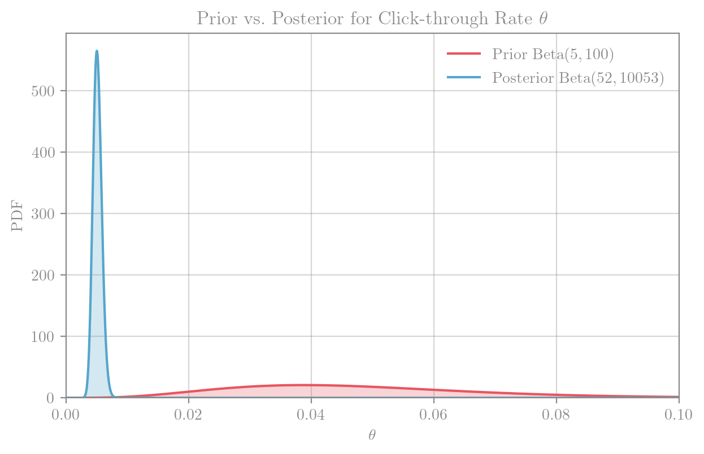

# Bayesian Inference {#sec-bayes-inference}

```python
import matplotlib.pyplot as plt

plot_bg = "#f8f8f8"

plt.rcParams["figure.facecolor"] = plot_bg
plt.rcParams["axes.facecolor"]   = plot_bg

dark_plot_bg = "#151515"

```

```{ojs}
bodyFont = getComputedStyle(document.body).fontFamily
```


## Introduction to the Bayesian Approach

So far we have taken a **frequentist perspective**: parameters such as $\theta$ are fixed but unknown, and all randomness comes from the sample.

Bayesian inference takes a different view:

* **Frequentist**: the parameter $\theta$ is **fixed but unknown**.
* **Bayesian**: the parameter $\theta$ is treated as a **random variable**.

The word *random* here does **not** mean that the parameter is physically fluctuating. Instead, it represents our **uncertainty** about its true value.

### Probability as Uncertainty

In the Bayesian framework, probability is interpreted as a way of **quantifying uncertainty** about unknown quantities.

Rather than saying “*the parameter is a fixed number we don’t know*”, we describe how plausible different values are using a probability distribution.

::: {#exm-bayes-umbrella}
#### Umbrella Decisions

Imagine the weather forecast says there is a $70\%$ chance of rain tomorrow.

* The sky doesn’t “rain in $70\%$ of parallel universes.”

* Instead, the number $70\%$ reflects our uncertainty given current information (satellite data, forecasts, etc.).

```{=html}
<details>
  <summary><strong> Show Plot </strong></summary>
```

```{ojs}
// === (A) Umbrella decision: 70% chance of rain (everyday uncertainty) ===
// Build a single horizontal bar split into "Rain" (0.7) and "No rain" (0.3)

rainP = 0.7
noRainP = 1 - rainP

umbrellaSegments = [
  { label: "Rain (70%)",    x1: 0,     x2: rainP,  which: "Rain" },
  { label: "No rain (30%)", x1: rainP, x2: 1,      which: "No rain" }
]
```

```{ojs}
//| label: fig-umbrella-uncertainty
//| fig-cap: Everyday uncertainty — a 70% chance of rain means our **belief** favours rain over no rain given current information.
//| fig-align: center
//| echo: false

Plot.plot({
  height: 120,
  marginLeft: 50,
  marginRight: 20,
  marginBottom: 45,
  x: { label: "Probability", domain: [0, 1], nice: false },
  y: { axis: null },
    style: {
      width: "100%",
      display: "block", 
      margin: "0 auto", 
      maxWidth: "960px",
      background: "var(--brand-bg)",
      color: "var(--brand-fg)",
      fontFamily: bodyFont, 
      fontSize: 12
    },
  marks: [
    Plot.ruleY([0], { stroke: "var(--border)", strokeOpacity: 0.6 }),
    // two stacked rectangles forming one bar
    Plot.rectX(umbrellaSegments, {
      x1: "x1",
      x2: "x2",
      y: 0,
      height: 24,
      fill: d => d.which === "Rain" ? "var(--brand-teal)" : "var(--brand-red)",
      fillOpacity: d => d.which === "Rain" ? 0.35 : 0.15,
      stroke: "var(--brand-fg)"
    }),
    // labels
    Plot.text(umbrellaSegments, {
      x: d => (d.x1 + d.x2) / 2,
      y: 0,
      text: "label",
      dy: -8
    })
  ]
})
```

```{=html}
</details>
```

:::

::: {#exm-bayes-exam-marks}
#### Exam Marks

Suppose $\theta$ is the average exam mark of a module. From past years, we believe:

* It’s usually around $60$ marks,

* but could reasonably be anywhere between $50$ and $70$.

We could represent this belief as a Normal prior distribution centred at $60$ with standard deviation $10$.

```{=html}
<details>
  <summary><strong> Show Plot </strong></summary>
```


```{ojs}
// === (B) Exam-mark prior: Normal(μ=60, σ=10) ===
// Domain and grid
markDomain = [0, 100]
markXs = d3.scaleLinear().domain(markDomain).ticks(400)

// Normal PDF helper
function normalPDF(x, mu, sigma){
  const z = (x - mu) / sigma;
  return Math.exp(-0.5 * z * z) / (sigma * Math.sqrt(2 * Math.PI));
}

// Prior parameters and curve
mu_prior = 60
sd_prior = 10

markPrior = markXs.map(x => ({ x, y: normalPDF(x, mu_prior, sd_prior), which: "Prior  N(60, 10²)" }))

// Shading bounds for "plausible" 50–70 region
loBand = 50
hiBand = 70
bandFill = markXs
  .filter(x => x >= loBand && x <= hiBand)
  .map(x => ({ x, y: normalPDF(x, mu_prior, sd_prior) }))
```

```{ojs}
//| label: fig-exam-prior-normal
//| fig-cap: Prior for the average exam mark. A Normal prior centred at $60$ with standard deviation $10$ encodes “likely around $60$, plausibly $50–70$”.
//| fig-align: center
//| echo: false

Plot.plot({
  height: 320,
  marginLeft: 48,
  marginBottom: 45,
  x: { label: "Average mark θ", domain: markDomain },
  y: { label: "Density" },
  style: {
    width: "100%",
    display: "block", 
    margin: "0 auto", 
    maxWidth: "960px",
    background: "var(--brand-bg)",
    color: "var(--brand-fg)",
    fontFamily: bodyFont, 
    fontSize: 12
  },
  marks: [
    Plot.ruleY([0], { stroke: "var(--border)", strokeOpacity: 0.6 }),
    // shade the 50–70 plausible band
    Plot.areaY(bandFill, { x: "x", y: "y", fill: "var(--brand-teal)", fillOpacity: 0.12 }),
    // main prior curve
    Plot.lineY(markPrior, { x: "x", y: "y", stroke: "var(--brand-teal)", strokeWidth: 2 }),
    // annotations
    Plot.ruleX([mu_prior], { stroke: "var(--brand-fg)", strokeWidth: 2, strokeDasharray: "3,3", strokeOpacity: 0.4 }),
    Plot.text(
      [
        { x: mu_prior + 8, y: normalPDF(mu_prior, mu_prior, sd_prior) * 0.99, label: "Prior mean 60" },
        { x: (loBand+hiBand)/2, y: normalPDF((loBand+hiBand)/2, mu_prior, sd_prior) / 3, label: "Plausible 50–70" }
      ],
      { x: "x", y: "y", text: "label", dy: -10 }
    )
  ]
})
```

```{=html}
</details>
```

:::

::: {#exm-bayes-disease}
#### Disease Prevalance
Let $\theta$ be the proportion of people with a rare condition.

Before collecting data, experts might believe $\theta$ is “probably around $2\%$, but definitely less than $10\%$”.

We could express this with a <span class="xref-no-num">[Beta distribution @sec-beta]</span> prior.


```{=html}
<details>
  <summary><strong> Show Plot </strong></summary>
```

```{ojs}
// === (C) Disease prevalence prior: Beta(2, 98) ~ mean 0.02, mass < 0.10 ===
// Domain and grid
pDomain = [0, 0.12]  // zoom in to show the small probabilities clearly
pXs = d3.scaleLinear().domain(pDomain).ticks(400)

// Beta PDF helper (using log-space for stability)
function logGamma(z){ // Lanczos approximation via d3? keep simple: use Math.lgamma fallback if present; else crude Stirling
  // Minimal Stirling for teaching visuals (fine for small α,β here)
  return (z-0.5)*Math.log(z) - z + 0.5*Math.log(2*Math.PI);
}
function betaLogPDF(x, a, b){
  if (x <= 0 || x >= 1) return -Infinity;
  return (a-1)*Math.log(x) + (b-1)*Math.log(1-x) - (logGamma(a)+logGamma(b)-logGamma(a+b));
}
function betaPDF(x, a, b){
  const lg = betaLogPDF(x, a, b);
  return Number.isFinite(lg) ? Math.exp(lg) : 0;
}

// Prior parameters and curve
alpha_prior = 2
beta_prior  = 98

betaPrior = pXs.map(x => ({ x, y: betaPDF(x, alpha_prior, beta_prior), which: "Prior  Beta(2, 98)" }))

// Optional “< 10%” visual marker
capThreshold = 0.10
```

```{ojs}
//| label: fig-beta-prevalence-prior
//| fig-cap: Prior for disease prevalence $\theta$ using a $\mathrm{Beta}(2, 98)$. This encodes “likely around $2\%$, very unlikely above $10\%$.”
//| fig-align: center
//| echo: false

Plot.plot({
  height: 320,
  marginLeft: 48,
  marginBottom: 45,
  x: { label: "Prevalence θ", domain: pDomain },
  y: { label: "Density" },
  style: {
    width: "100%",
    display: "block", 
    margin: "0 auto", 
    maxWidth: "960px",
    background: "var(--brand-bg)",
    color: "var(--brand-fg)",
    fontFamily: bodyFont, 
    fontSize: 14
  },
  marks: [
    Plot.ruleY([0], { stroke: "var(--border)", strokeOpacity: 0.6 }),
    Plot.lineY(betaPrior, { x: "x", y: "y", stroke: "var(--brand-red)", strokeWidth: 2, strokeOpacity: 0.9 }),
    Plot.areaY(betaPrior, { x: "x", y: "y", fill: "var(--brand-red)", fillOpacity: 0.15 }),
    // visual cap at 10%
    Plot.ruleX([capThreshold], { stroke: "var(--brand-fg)", strokeDasharray: "3,3", strokeOpacity: 0.6 }),
    Plot.text(
      [
        { x: 0.02, y: betaPDF(0.02, alpha_prior, beta_prior), label: "Prior mean ≈ 2%" },
        { x: capThreshold, y: 0, label: "10% upper cap (unlikely)" }
      ],
      { x: "x", y: "y", text: "label", dy: -10 }
    )
  ]
})
```

```{=html}
</details>
```

:::

This provides a **language of degrees of belief**: probability distributions describe how plausible different values of $\theta$ are, given what we know.

### The Bayesian Inference Procedure

The Bayesian approach to inference has three ingredients:

1. **Prior** — a probability distribution that captures what we believe about $\theta$ *before* seeing the data.
2. **Likelihood** — the distribution of the data $\underline{x}$ given $\theta$.
3. **Posterior** — the updated distribution for $\theta$ that combines prior information with the evidence from the data.

The update is performed using **Bayes’ theorem** (introduced in the next section). Intuitively:

$$
\text{Posterior} \;\; \propto \;\; \text{Likelihood} \times \text{Prior}.
$$

This equation expresses the central idea: *our beliefs about $\theta$ are revised in light of the observed data*.

## Bayes' Theorem for Densities

Bayesian inference is named after <span class="xref-no-num">[Bayes’ Theorem @thm-bayes]</span>, a general identity in probability theory. For two events $A$ and $B$, the conditional probability is given by
$$
\mathrm{Pr}(A \mid B) = \frac{\mathrm{Pr}(B \mid A)\,\mathrm{Pr}(A)}{\mathrm{Pr}(B)}.
$$
This rule is sometimes described as **reversing conditioning**: it lets us swap the order, turning “$B$ given $A$” into “$A$ given $B$,” with a correction for their overall probabilities.

To apply this idea in Bayesian inference, we extend it from events to random variables and their densities. Using <span class="xref-no-num">[conditional densities @def-conditional-pdf]</span>,
$$
f_{X \mid Y}(x \mid y) = \frac{f_{XY}(x,y)}{f_Y(y)},
$$

we arrive at Bayes’ theorem for densities.

::: {.thm #thm-bayes-density}
### Bayes’ Theorem for Densities.
For random variables $X$ and $Y$ with joint density (or PMF) $f(x,y)$:

$$
f(x \mid y) = \frac{f(y \mid x)\,f(x)}{f(y)}.
$$

:::

::: {.prf #prf-bayes}
By the definition of conditional density:

$$
f(x \mid y) = \frac{f(x,y)}{f(y)}, 
\qquad
f(y \mid x) = \frac{f(x,y)}{f(x)}.
$$

Rearranging the second expression gives $f(x,y) = f(y \mid x) f(x)$. Substituting this into the first gives

$$
f(x \mid y) = \frac{f(y \mid x) f(x)}{f(y)}.
$$
:::


## Bayes’ Theorem in Statistics

Once we have specified a parameter $\theta$, the model tells us the **distribution of the data**:
$$
f(\underline{x} \mid \theta).
$$

This is the <span class="xref-no-num">[likelihood @sec-likelihood]</span> (the joint density/PMF of the observed sample under $\theta$).

Our Bayesian goal is the reverse: to describe the **distribution of the parameter given the data**:
$$
\pi(\theta \mid \underline{x}).
$$

This is exactly the “reversing conditioning” step that <span class="xref-no-num">[Bayes’ theorem @thm-bayes]</span> makes possible. It takes the likelihood $f(\underline{x}\mid \theta)$ and the prior $\pi(\theta)$ and turns them into the posterior $\pi(\theta \mid \underline{x})$:
$$
\text{Known: } f(\underline{x}\mid \theta)
\quad\;\; \xRightarrow[\text{Bayes’ theorem}]{} \quad\;\;
\text{Wanted: } \pi(\theta \mid \underline{x})
$$

::: {.remark}
### Likelihood vs. Likelihood Function
Here we use **likelihood** to mean the joint density/PMF $f(\underline{x}\mid\theta)$ itself.  

When viewed as a function of $\theta$ (with the data fixed), this is the <span class="xref-no-num">[likelihood function @def-likelihood]</span>. In this course, we will not stress this distinction further.
:::


::: {#imp-notation-bayes .callout-important collapse="true" appearance="simple"}

### Notation in Bayesian Statistics

Both frequentist and Bayesian inference involve probability distributions for the **data**.

* In the **frequentist setting** we write

  $$
  X_i \sim \mathrm{Distribution}(\theta),
  $$

  where $\theta$ is a fixed but unknown parameter.

* In the **Bayesian setting** we write

  $$
  X_i \mid \theta \sim \mathrm{Distribution}(\theta),
  $$

  where the conditioning bar $\mid \theta$ emphasises that $\theta$ itself is random, and we are describing the distribution of the data **given** a particular value of $\theta$.

In both cases, $f(x_i \mid \theta)$ denotes the PDF/PMF of the data conditional on $\theta$.

---

**The Bayesian addition:** we also introduce probability distributions *over the parameter $\theta$ itself*.
To emphasise the difference in notation:

* **Prior distribution** (before data): $\pi(\theta)$
* **Posterior distribution** (after data): $\pi(\theta \mid \underline{x})$

In Bayesian inference there are therefore two distinct kinds of distributions, which our notation keeps separate:

* **Data distributions:** $f(x \mid \theta)$ describe how the data would look *if we knew $\theta$*.
* **Parameter distributions:** $\pi(\theta)$ and $\pi(\theta \mid \underline{x})$ describe our *uncertainty about $\theta$*.

:::

### From Bayes’ theorem to the Posterior

To apply <span class="xref-no-num">[Bayes’ theorem @thm-bayes-density]</span> in statistics we make the identification:

- $x = \theta$ : the **parameter**, treated as a random variable.  
- $y = \underline{x}$ : the **observed data**.  

This leads directly to the **posterior distribution**:

$$
\pi(\theta \mid \underline{x}) 
= \frac{f(\underline{x} \mid \theta)\,\pi(\theta)}{f(\underline{x})}.
$$

::: {.definition #def-prior}
### Prior Distribution.
The **prior distribution** represents our uncertainty about $\theta$ *before observing the data*.

We denote its density (PDF or PMF) by

$$
\pi(\theta).
$$
:::


::: {.definition #def-posterior}
### Posterior Distribution

The **posterior distribution** represents our uncertainty about $\theta$ *after observing the data*.

It is defined by
$$
\pi(\theta \mid \underline{x}) 
= \frac{f(\underline{x} \mid \theta)\,\pi(\theta)}{f(\underline{x})}.
$$

- The **likelihood** $f(\underline{x} \mid \theta)$ is the term where data and parameter appear together; it is this dependence that updates the prior into the posterior.
- The **prior** $\pi(\theta)$ reflects what we believed about $\theta$ before seeing the data.
- The denominator $f(\underline{x})$ is a normalising constant ensuring the posterior integrates to $1$.
:::

### Posteriors in Practice {#sec-posteriors-in-practice}

We now work through a simple example to see how this update works.

::: {.example #exm-biased-coin}
## Biased Coin

Let $\theta = \Pr(\text{Head})$ for a possibly biased coin.

* **Prior:** Before seeing data, we express no preference over $\theta \in (0,1)$ by choosing a **uniform prior**:

  $$
  \theta \sim \mathrm{Uniform}(0,1) \equiv \mathrm{Beta}(1,1), 
  \qquad \pi(\theta) = 1 \text{ for } 0<\theta<1.
  $$

  This prior has mean $\mathrm{E}[\theta]=0.5$.

* **Data:** We toss the coin $n=5$ times and observe $x=1$ head.

* **Posterior:** Bayes’ theorem combines the Binomial likelihood with the prior to give $\pi(\theta \mid x)$.

```{=html}
<details>
  <summary><strong> Solution </strong></summary>
```

Let $X$ be the number of heads in $5$ tosses. Assuming that each coin throw is *independent and identically distributed*, $X$ is Binomial[^binomial]:
$$
    X \mid \theta \sim \textrm{Bin}(5,\theta).
$$
Note that there is only a **single observation** here: one experiment is "tossing the coin $5$ times and seeing how many come up heads". The probability of observing $X=1$ is
$$
    f(x = 1 \mid \theta) = 5\theta(1-\theta)^4
$$
If we plot this:

```python
#| echo: true
#| code-fold: true
#| code-summary: "Show code"
#| fig-align: center

import matplotlib.pyplot as plt
import numpy as np
import math

def binom_lik(theta):
    return 5 * theta * (1 - theta) ** 4


theta_grid = np.linspace(0, 1, 200)
binom_lik_vals = binom_lik(theta_grid)

plt.figure(figsize=(5,3))
plt.plot(theta_grid, binom_lik_vals)
plt.xlabel(r"$\theta$")
plt.ylabel("Likelihood")
plt.title("Binomial Likelihood (with $n=5$ and $X=1$)")
plt.tight_layout()
plt.show()  
```

we see that this favours $\theta$ around $0.2$. In fact, in @exm-binom-mle-single, we saw that the MLE is $\hat{\theta} = 0.2$.

Our prior for $\theta$ was $\pi(\theta) = 1$, for $0 < \theta < 1$. To update our beliefs, by conditioning on the single observation $x=2$, we use <span class="xref-no-num">[Bayes' Theorem @def-posterior]</span>:
$$
    \pi(\theta|x=1)=\frac{\pi(\theta)f(x=1|\theta)}{f(x=1)} = \frac{1 \times 5\theta(1-\theta)^4}{f(x=1)}, \quad 0 < \theta < 1.
$$
To compute the *denominator*, $f(x=1)$, we use the <span class="xref-no-num">[law of total probability @thm-total-probability-pdfs]</span>:

\begin{align*}
f(x=1) &=\int_\Theta\pi(\theta)f(x=1\, |\,\theta)\,d\theta = \int_0^1 1\times 5\theta(1-\theta)^4\,d\theta \\
&=\int_0^1 \theta\times 5(1-\theta)^4\,d\theta =\left[-(1-\theta)^5\,\theta\right]^1_0
+\int_0^1 (1-\theta)^5\,d\theta \\
&=0 + \left[-\frac{(1-\theta)^6}{6}\right]^1_0 =\frac{1}{6}. 
\end{align*}

Therefore, the posterior density is (for $0<\theta<1$):

\begin{align*}
\pi(\theta|x=1)&=\frac{\pi(\theta)f(x=1|\theta)}{f(x=1)} =\frac{5\theta(1-\theta)^4}{1/6}\\
&=30\,\theta(1-\theta)^4 =\frac{\theta(1-\theta)^4}{\mathrm{B}(2,5)},\quad\quad 0<\theta<1,
\end{align*}

and so the posterior distribution is $\theta|x=1\sim \textrm{Beta}(2,5)$. This distribution has its mode at
$\theta=0.2$, and mean at $\mathrm{E}[\theta|x=1]=2/7=0.286$.


```{=html}
</details>
```

:::


The main difficulty in calculating the posterior distribution was in obtaining the $f(x)$ term. However, in many cases we can recognise the posterior distribution without the need to calculate this constant term (constant with respect to $\theta$). In this example, we can calculate the posterior distribution as

\begin{align*}
\pi(\theta|\underline{x})&\propto\pi(\theta)f(x=1|\theta) \\
&\propto 1\times 5\theta(1-\theta)^4,\quad\quad 0<\theta<1  \\
&=k\theta(1-\theta)^4,\quad\quad 0<\theta<1.
\end{align*}


As $\theta$ is a continuous quantity, what we would like to know is what continuous distribution defined on $(0,1)$ has a probability density function which takes the form $k\theta^{g-1}(1-\theta)^{h-1}$. The answer is the $\textrm{Beta}(g,h)$ distribution. Therefore, choosing $g$ and $h$ appropriately, we can see that the posterior distribution is $\theta|x=1\sim \textrm{Beta}(2,5)$.

---

**Interpretation:**

* **Most likely value (mode):** $\hat{\theta} \approx 0.2$, the same as the sample proportion $1/5$.
* **Posterior mean:** $\mathrm{E}[\theta \mid x] \approx 0.286$, slightly larger than $0.2$ because the prior was centred at $0.5$.
* **Uncertainty reduced:** the posterior standard deviation shrinks from $0.289$ (prior) to $0.160$ (posterior).

So, after seeing the data, our beliefs about $\theta$ have been updated: we now think small values of $\theta$ are more plausible, but not as extremely as the raw data alone would suggest.

```{=html}
<details>
  <summary><strong> Show Plot </strong></summary>
```

```{ojs}
// Domain and grid
mDomain = [0, 1]
pdfXs = d3.scaleLinear().domain(mDomain).ticks(200)  // 201 points including 0 and 1

// PDFs (closed-form)
function priorPDF(x)     { return (x > 0 && x < 1) ? 1 : 0; }
function posteriorPDF(x) { return (x > 0 && x < 1) ? 30 * x * (1 - x) ** 4 : 0; }

// Data (use the scalar x from map!)
prior = pdfXs.map(x => ({ x, y: priorPDF(x), which: "Prior  Beta(1,1)" }))
post  = pdfXs.map(x => ({ x, y: posteriorPDF(x), which: "Posterior  Beta(2,5)" }))
```

```{ojs}
//| label: fig-beta-posterior
//| fig-cap: Prior and posterior distributions for the coin bias parameter $\theta=\Pr(\text{Head})$ after observing 1 head in 5 tosses. The posterior is more concentrated, reflecting reduced uncertainty about $\theta$ compared to the uniform prior
//| fig-align: center
//| echo: false

// Create the plot directly without viewof
Plot.plot({
  // omit width to let it be responsive
  height: 320,
  marginLeft: 48,
  marginBottom: 45,
  x: { label: "θ", domain: [0, 1] },
  y: { label: "Density" },
  style: {
    width: "100%",
    display: "block", 
    margin: "0 auto", 
    maxWidth: "960px",
    background: "var(--brand-bg)",
    color: "var(--brand-fg)",
    fontFamily: bodyFont, 
    fontSize: 14
  },
  marks: [
    Plot.ruleY([0], { stroke: "var(--border)", strokeOpacity: 0.6 }),
    Plot.lineY(prior, { x: "x", y: "y", stroke: "var(--brand-red)",  strokeWidth: 2, strokeOpacity: 0.85 }),
    Plot.areaY(prior, { x: "x", y: "y", fill: "var(--brand-red)", fillOpacity: 0.05 }),
    Plot.lineY(post,  { x: "x", y: "y", stroke: "var(--brand-teal)", strokeWidth: 2 }),
    Plot.areaY(post,  { x: "x", y: "y", fill: "var(--brand-teal)", fillOpacity: 0.2 }),
    Plot.text(
      [
        { x: 0.8, y: priorPDF(0.8),     label: "Prior" },
        { x: 0.35, y: posteriorPDF(0.3), label: "Posterior" }
      ],
      { x: "x", y: "y", text: "label", dy: -8 }
    )
  ]
})
```

```{=html}
</details>
```


---

::: {#exm-music-expert}
Consider an experiment to determine how good a music expert is at distinguishing between pages from Haydn and Mozart scores. Let $\theta=\mathrm{Pr}(\text{correct choice})$. Suppose that, before conducting the experiment, we have been told that the expert is very competent. In fact, it is suggested that we should have a prior distribution which has a mode around $\theta=0.95$ and for which $\mathrm{Pr}(\theta<0.8)$ is very small. We choose $\theta\sim \textrm{Beta}(77,5)$, with probability density function
$$
\pi(\theta)=128107980\,\theta^{76}(1-\theta)^4,\quad\quad 0<\theta<1.
$$
A graph of this prior density is given as follows:

::: {.panel-tabset}

### Python


```python
#| echo: true
#| code-fold: true
#| code-summary: "Show code"
#| fig-align: center

import numpy as np
import math
import matplotlib.pyplot as plt

# Beta(α, β) with α=77, β=5  →  π(θ) ∝ θ^(76) (1-θ)^(4)
alpha, beta = 77, 5

# B(α,β) = Γ(α)Γ(β)/Γ(α+β)  ⇒  1/B = exp(lgamma(α+β) - lgamma(α) - lgamma(β))
# Note the lgamma function computes the logarithm of the Gamma function.
beta_const_inv = math.exp(math.lgamma(alpha + beta) - math.lgamma(alpha) - math.lgamma(beta))

def beta_pdf(theta):
    return beta_const_inv * np.power(theta, alpha - 1) * np.power(1 - theta, beta - 1)

theta_grid = np.linspace(0.0, 1.0, 500)
pdf_values = beta_pdf(theta_grid)

plt.figure(figsize=(7,4))
plt.plot(theta_grid, pdf_values)
plt.xlabel(r"$\theta$")
plt.ylabel("Density")
plt.title(rf"Beta PDF: $\alpha={alpha}$, $\beta={beta}$")
# plt.xlim(0, 1)
plt.tight_layout()
plt.show()
```

### R

```{r}
#| echo: true
#| code-fold: true
#| code-summary: "Show code"
#| fig-align: center

alpha <- 77
beta  <- 5

# Normalising constant via log-gamma (works like Python's lgamma)
beta_const_inv <- exp(lgamma(alpha + beta) - lgamma(alpha) - lgamma(beta))

beta_pdf <- function(theta) {
  beta_const_inv * theta^(alpha - 1) * (1 - theta)^(beta - 1)
}

theta_grid <- seq(0, 1, length.out = 500)
pdf_values <- beta_pdf(theta_grid)

plot(theta_grid, pdf_values, type = "l",
     xlab = expression(theta), ylab = "Density",
     main = bquote("Beta PDF: " ~ alpha == .(alpha) ~ "," ~ beta == .(beta)))
```

:::

```{=html}
<details>
  <summary><strong> Solution </strong></summary>
```

```{=html}
</details>
```

:::


::: {#exm-instagram-bin}

Software engineers at **Instagram** are interested in the click-through rate $\theta$ of their advertisement recommender.

The **click-through rate** is the proportion of clicks out of the total number of impressions of an online advertisement.

The engineers assess the click-through rate by testing their recommender on users of Instagram. They obtain a total of $n$ impressions.

(a) Using a <span class="xref-no-num">[Beta prior @sec-beta]</span>, quantify your prior beliefs about $\theta$.
(b) After running the test, the engineers obtained a total of $X=47$ successful clicks out of a total of $n=10,000$ impressions. Using a **Binomial** model and your prior specified in part (a), obtain the posterior distribution for $\theta$.

```{=html}
<details>
  <summary><strong> Solution </strong></summary>
```

**a.**

I personally never click on adverts, apart from on accident. I don’t think many people do. So, I believe that the click-through rate $\theta$ should be close to $0$.

I am not very confident, so I will pick:

$$
\theta \sim \text{Beta}(5,\,100).
$$

This prior has mean

$$
\frac{5}{5+100} \approx 0.047,
$$

and places the vast majority of its probability mass on values $\theta < 0.1$.

---

**b.**

The data model is

$$
X \mid \theta \sim \text{Binomial}(n=10000,\, \theta), \qquad X = 47,
$$

which has PMF

$$
f(x=47 \mid \theta) 
= \binom{10000}{47} \theta^{47}(1-\theta)^{9953}.
$$

Using Bayes’ theorem:

$$
\pi(\theta \mid x) 
\;\propto\; f(x \mid \theta)\,\pi(\theta).
$$

From part (a) the prior is

$$
\pi(\theta) \;\propto\; \theta^{\alpha-1}(1-\theta)^{\beta-1},
\qquad \alpha=5, \;\beta=100.
$$

Therefore,

$$
\pi(\theta \mid x) 
\;\propto\; \theta^{47}(1-\theta)^{9953}\;\cdot\;\theta^{\alpha-1}(1-\theta)^{\beta-1}.
$$

Simplifying exponents:

$$
\pi(\theta \mid x) 
\;\propto\; \theta^{(\alpha+47)-1}(1-\theta)^{(\beta+9953)-1}.
$$

Thus, the posterior distribution is

$$
\theta \mid x \sim \text{Beta}(\alpha+47, \; \beta + 9953).
$$

Substituting $\alpha=5$, $\beta=100$:

$$
\theta \mid X \sim \text{Beta}(5+47, \; 100 + 9953) = \text{Beta}(52, \; 10053).
$$

---

**Interpretation.**

* The posterior mean is

$$
\mathrm{E}[\theta \mid X] = \frac{52}{52+10053} \approx 0.0052,
$$

which is about **0.52% click-through rate**.

* The posterior variance is very small because $n=10{,}000$ is large, so the engineers can be quite confident that $\theta$ is very close to $0.5%$.

```{=html}
<details>
  <summary><strong> Show Plot </strong></summary>
```




```{=html}
</details>
```


```{=html}
</details>
```

:::


::: {.example #exm-particle-speed}
### Measuring a particle’s speed

You are attempting to measure the **speed of a particle** $\theta$ and quantify the uncertainty in the measurement. The experiment is set up such that the particle **travels** $1$ km and the measurements are the speeds $X_i \mid \theta$ for $i=1,\ldots,n$ in kilometres per second (km/s).

There are a **multitude of factors** that additively result in **measurement error** for the speed of the particle.

**(a)** Using a **normal prior**, quantify **your prior beliefs** about $\theta$.

```{=html}
<details>
  <summary><strong>Solution (a)</strong></summary>
````

Since speed is physically constrained, a normal prior is imperfect because it places mass on the whole real line. For speed we should have $0< \theta < c$, where $c=299{,}792 \text{km/s}$ (speed of light).

Nonetheless, if we are asked to use a normal prior and have little prior knowledge about the particle type, a weakly informative prior is reasonable, e.g.

$$
\theta \sim \mathcal{N}\!\big(1.5\times 10^5,\ (4\times 10^4)^2\big).
$$

This concentrates most mass in the physically plausible range while remaining diffuse.

```{=html}
</details>
```

---

**(b)** Why is a **normal distribution** appropriate for the likelihood? Write down the likelihood.

```{=html}
<details>
  <summary><strong>Solution (b)</strong></summary>
```

Because many small, additive, independent sources of error contribute to each measurement, the <span class="xref-no-num">[Central Limit Theorem @thm-clt]</span> motivates

$$
X_i \mid \theta \stackrel{\text{iid}}{\sim} \mathcal{N}(\theta,\sigma^2).
$$

Hence the likelihood is

\begin{align*}
f(\underline{x}\mid \theta,\sigma)
&= (2\pi)^{-n/2}\sigma^{-n}
\exp\!\left\{-\frac{1}{2\sigma^2}
\sum_{i=1}^n (x_i-\theta)^2\right\} \\
&= (2\pi)^{-n/2}\sigma^{-n}
\exp\!\left\{-\frac{1}{2\sigma^2}
\Big(\sum_{i=1}^n x_i^2 - 2\theta \sum_{i=1}^n x_i + n\theta^2\Big)\right\}.
\end{align*}

```{=html}
</details>
```

---

**(c)** Assuming the **standard deviation** $\sigma$ of the measurements is known, derive the posterior under a prior $\theta \sim \mathcal{N}(\mu_0,\sigma_0^2)$.

```{=html}
<details>
  <summary><strong>Solution (c)</strong></summary>
```

Up to proportionality,

$$
f(\underline{x}\mid\theta,\sigma)\ \propto\ 
\exp\!\left\{-\frac{1}{2\sigma^2}\big(n\theta^2-2n\bar{x}\,\theta\big)\right\},\qquad
\pi(\theta)\ \propto\ 
\exp\!\left\{-\frac{1}{2\sigma_0^2}\big(\theta^2-2\mu_0\theta\big)\right\}.
$$

Multiplying and completing the square, the posterior is normal with precision (inverse variance)

$$
\frac{1}{V}=\frac{n}{\sigma^2}+\frac{1}{\sigma_0^2},
\qquad
M = V\left(\frac{n\bar{x}}{\sigma^2}+\frac{\mu_0}{\sigma_0^2}\right).
$$

Therefore,

$$
\boxed{\ \theta\mid \underline{x}\ \sim\ \mathcal{N}(M,V)\ }.
$$

```{=html}
</details>
```

---

**(d)** Suppose you measured the speed $4$ times and obtained (km/s):
$306135,\ 293227,\ 307985,\ 301298$.
Using the prior from (a), set $\sigma=5000$ and derive your **posterior distribution**.

```{=html}
<details>
  <summary><strong>Solution (d)</strong></summary>
```

Compute $\bar{x}=(306135+293227+307985+301298)/4=302{,}161.25$.
With $\mu_0=150{,}000$, $\sigma_0^2=(40{,}000)^2$, $\sigma^2=(5{,}000)^2$, $n=4$:

$$
\frac{1}{V}=\frac{n}{\sigma^2}+\frac{1}{\sigma_0^2}
=\frac{4}{25{,}000{,}000}+\frac{1}{1{,}600{,}000{,}000}
=1.60625\times 10^{-7},
\quad
V=\frac{1}{1.60625\times 10^{-7}}\approx 6{,}225{,}681.
$$

$$
M = V\left(\frac{n\bar{x}}{\sigma^2}+\frac{\mu_0}{\sigma_0^2}\right)
\approx 6{,}225{,}681\left(\frac{4\cdot 302{,}161.25}{25{,}000{,}000}+\frac{150{,}000}{1{,}600{,}000{,}000}\right)
\approx 301{,}569.18.
$$

Thus,

$$
\boxed{\ \theta\mid \underline{x}\ \sim\ \mathcal{N}\!\big(301{,}569.2,\ 6{,}225{,}681\big)\ }
\quad \text{(i.e., SD } \approx 2{,}495.1\text{ km/s)}.
$$

```{=html}
</details>
```

:::


### Conjugacy {#sec-conjugacy}


In all the examples in <span class="xref-no-num">[Posteriors in Practice @sec-posteriors-in-practice]</span>, a notable phenomenon occurred:

1. The **prior** distribution $\pi(\theta)$
2. The resulting **posterior** distribution $\pi(\theta \mid \underline{x})$

belonged to the same *family of distributions*.

In Bayesian inference, this property is called **conjugacy**, and it allows us to derive posterior distributions in closed form without approximation.

::: {#def-conjugacy}

#### Conjugate Prior

Suppose $f(\underline{x} \mid \theta)$ is the joint PDF/PMF of the observations.

A prior distribution for $\theta$ is said to be **conjugate** if, after updating with the data, the posterior distribution $\pi(\theta \mid \underline{x})$ remains in the same family as the prior $\pi(\theta)$.

:::

::: {#rem-conjugcay}

#### Why is conjugacy useful?

* Conjugacy makes Bayesian updating *algebraically simple*: posterior parameters can often be obtained by just “updating counts” or “adding observations”.
* This provides intuition for how prior information and data combine, and gives closed-form formulas that are easy to compute.

:::


## Asymptotic Posterior Distribution

In **frequentist statistics**, we saw two important results about the <span class="xref-no-num">[asymptotic @imp-term-asymptotic]</span> sampling distribution of estimators:

1. The <span class="xref-no-num">[Central Limit Theorem @thm-clt]</span> showed that the sampling distribution of the <span class="xref-no-num">[sample mean @def-sample-mean]</span> is approximately Normal for large $n$.
2. The <span class="xref-no-num">[Asymptotic Distribution of the MLE @thm-asymp-mle]</span> showed that the sampling distribution of the maximum likelihood estimator is approximately Normal for large $n$.

A similar phenomenon occurs in **Bayesian inference**: for large samples, the **posterior distribution** itself becomes approximately Normal, regardless of the prior (as long as it is not too extreme).

::: {#thm-bernstein-von-mises}

### Bernstein–von Mises

Suppose we have an i.i.d. sample $X_1,\ldots,X_n$ drawn from the same distribution with PDF/PMF $f(x \mid \theta)$ and let $\pi(\theta \mid \underline{X}^{(n)})$ denote the posterior distribution for $\theta$.

Under *regularity conditions*, as $n \to \infty$ the posterior distribution satisfies

$$
\theta \mid \underline{X}^{(n)} \;\overset{\text{approx.}}{\sim}
\mathcal{N}\!\Big(\hat{\theta}_n,\, \mathcal{I}_n(\theta)^{-1}\Big),
$$

where

* $\hat{\theta}_n$ is the MLE,
* $\mathcal{I}_n(\theta)$ is the <span class="xref-no-num">[Fisher information @prp-fisher-one-obs]</span> for the **whole sample**.
 
:::


[^binomial]:
  **Binomial distribution.** If we assume each coin throw $C_i$ is an i.i.d. $\textrm{Bernoulli}(\theta)$ trial with a $1$ representing a heads landing, and a $0$ representing a tails, the total number of heads out of $5$ is $X = C_1 + C_2 + C_3 + C_4 + C_5$. Therefore:
    $$
        X \mid \theta \sim \textrm{Bin}(5,\theta).
    $$


